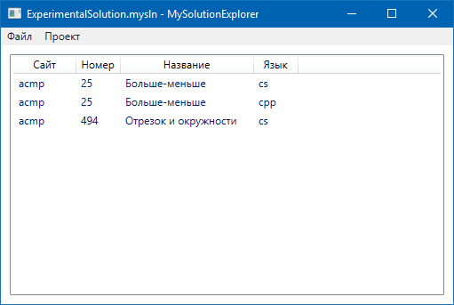

# MySolutionExplorer
 

Надоело вручную создавать проекты с одним кодовым файлом для решения олимпиадных задач? Хочется чтобы все были в одном месте, чтобы их можно было открыть из многих сред разработки? Решение есть – этот проект!

##Что уже есть:
 1. Создание `C++` и `C#` проектов
 2. Сохранение и загрузка группы проектов в `xml`-файл `.mysln`

## Что планируется добавить:
1. Очистка от бинарников и лишних файлов
2. Создание проектов на разных языках:
     - `Python`
     - `PascalABC.NET` и `Pascal`
     - `Java`
3. Больше сред разработки:
     - `SharpDevelop`
     - `Rider`, `Clion`, `IDEA`, `PyCharm`
     - `MinGW Developer Studio`
     - `Code::Blocks`
4. Сборка
 
## Сборка и релиз
Есть один рабочий релиз, сборка последнего коммита может быть с багами

###Лицензия
Вдруг это станет кому-то нужным кроме меня, а я без лицензии и копирайта, поэтому [MIT license](LICENSE).
